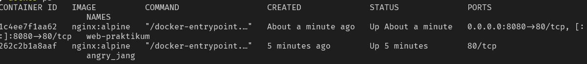
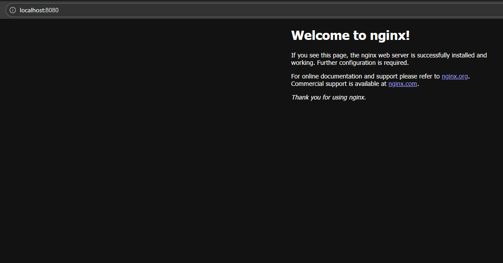
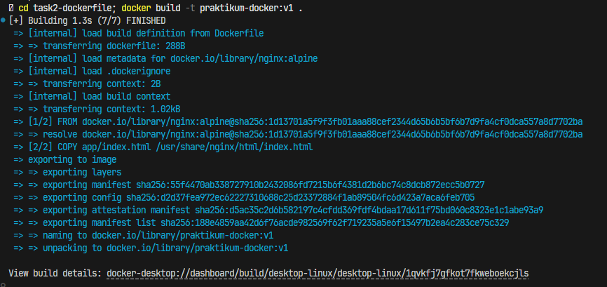
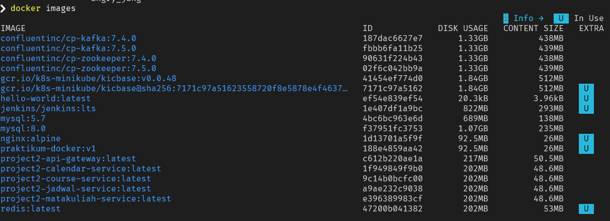
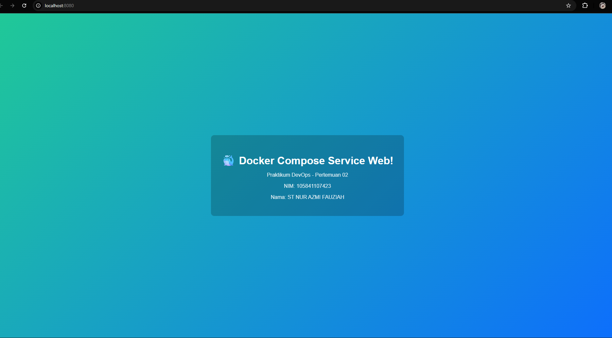

# Laporan Praktikum - Pertemuan 02
**Nama**: ST NUR AZMI FAUZIAH
**NIM**: 105841107423

## Task 1: Eksplorasi Docker Dasar
**Tujuan**: Memahami lifecycle container Docker

### Langkah-langkah yang dilakukan:
1. Pull image nginx: `docker pull nginx:alpine`
2. Menjalankan container: `docker run -d --name web-praktikum -p 8080:80 nginx:alpine`
3. Mengakses nginx melalui browser (`http://localhost:8080`).
4. Melihat log container: `docker logs web-praktikum`
5. Masuk ke dalam container dan mengecek file konfigurasi: `docker exec -it web-praktikum sh`
6. Menghentikan dan menghapus container.

### Screenshot Hasil:
- **Output `docker ps` saat container berjalan**
  
- **Tampilan browser mengakses nginx**
  

*(Catatan: Screenshot output log akan diletakkan di dalam folder screenshots sesuai kebutuhan)*

## Task 2: Membuat Docker Image
**Tujuan**: Membuat custom Docker image menggunakan Dockerfile

### Langkah-langkah yang dilakukan:
1. Membuat struktur direktori `app` dan file `index.html` dengan desain web.
2. Membuat `Dockerfile` yang menggunakan base image `nginx:alpine` dan menyalin file `index.html` ke direktori nginx.
3. Build image dengan nama `praktikum-docker:v1`.
4. Menjalankan container dengan custom image tersebut di port 8080.

### Screenshot Hasil:
- **Output `docker build`**
  
- **Output `docker images` yang menampilkan image dibuat**
  

## Task 3: Docker Compose Multi-Container
**Tujuan**: Menjalankan aplikasi dengan database menggunakan Docker Compose

### Langkah-langkah yang dilakukan:
1. Membuat file `docker-compose.yml` yang berisi 3 services:
   - `web` (nginx:alpine) terhubung ke direktori `./app`.
   - `api` (httpd:alpine).
   - `db` (postgres:15-alpine) dengan volume untuk persistent data.
2. Menjalankan semua services menggunakan `docker compose up -d`.
3. Mengecek status container via `docker compose ps` dan log dengan `docker compose logs`.
4. Mengakses masing-masing services melalui browser.
5. Cleanup environment menggunakan `docker compose down -v`.

### Screenshot Hasil:
- **Output `docker compose ps`**
  
- **Browser mengakses services**
  

